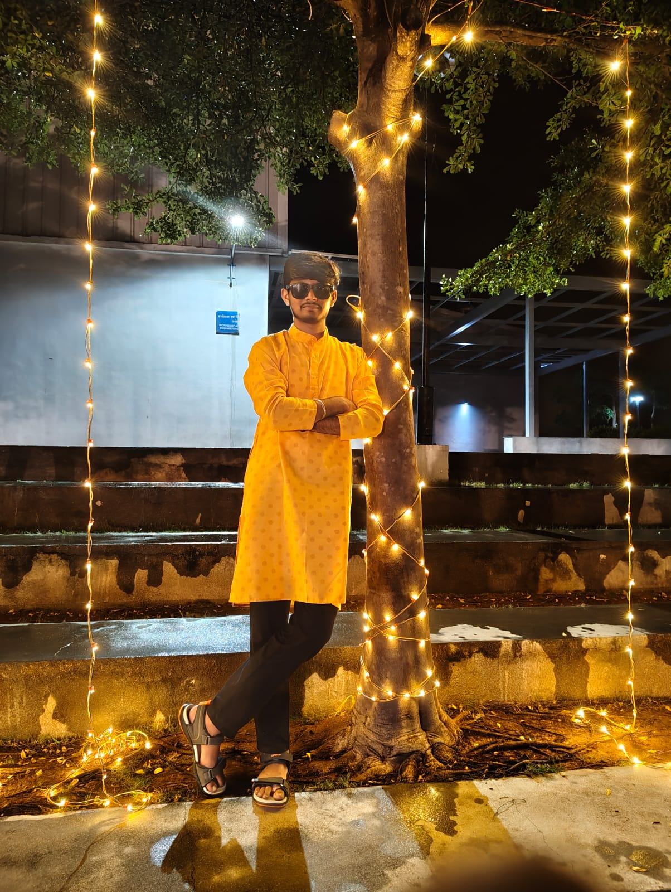
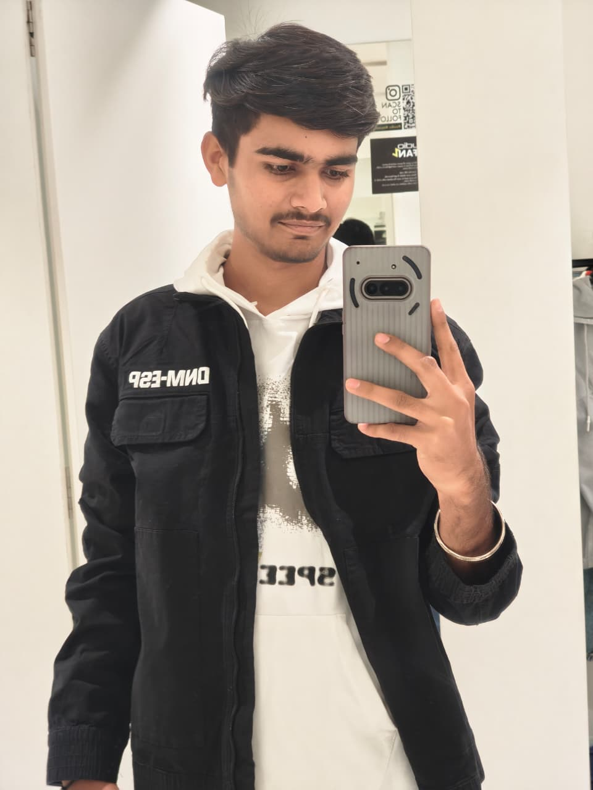
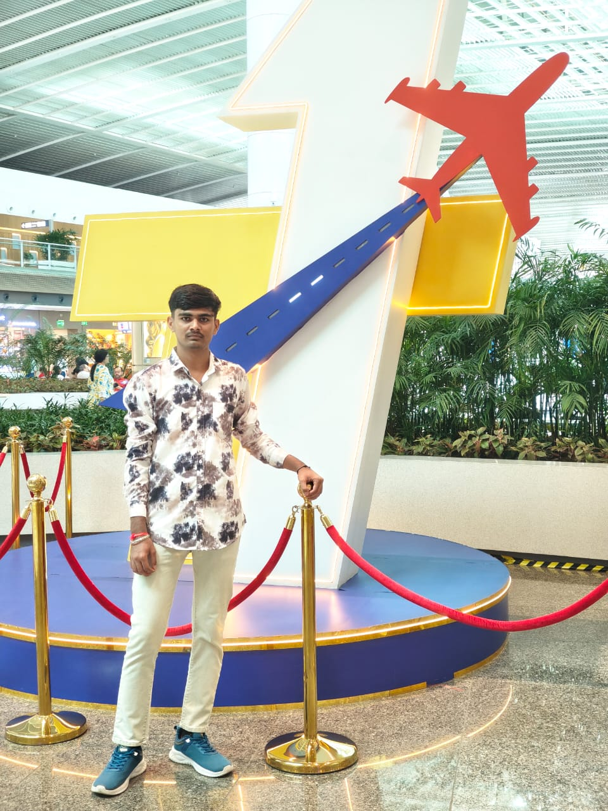
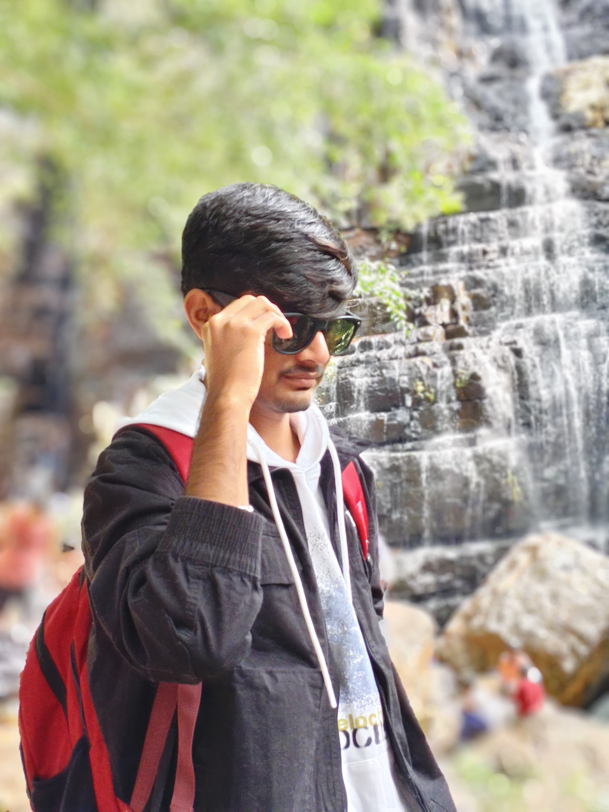

<!DOCTYPE html>
<html>
<head>
<meta charset="UTF-8">
<meta name="viewport" content="width=device-width, initial-scale=1.0">
<title>Happy Birthday Brother</title>

</head>

<body>

<canvas id="fireworks"></canvas>

<!-- PAGE 1 -->

  <h1>🎉 Happy Birthday Brother 🎂</h1>
  
You are hero ❤️

  
  <button onclick="playMusic(1)">▶ Play Song</button>
  <button onclick="nextPage(2)">Next ➜</button>
  <audio id="audio1" src="song1.mp3.mp3"></audio>

<!-- PAGE 2 -->

  <h1>💙 Memories 💙</h1>
  
  
  
  <button onclick="playMusic(2)">▶ Play Song</button>
  <button onclick="nextPage(3)">Next ➜</button>
  <audio id="audio2" src="song2.mp3.mp3"></audio>

<!-- PAGE 3 -->

  <h1>🌟 Best Brother Forever 🌟</h1>
  
  <button onclick="playMusic(3)">▶ Play Song</button>
  <audio id="audio3" src="song3.mp3.mp3"></audio>

</body>
</html>
